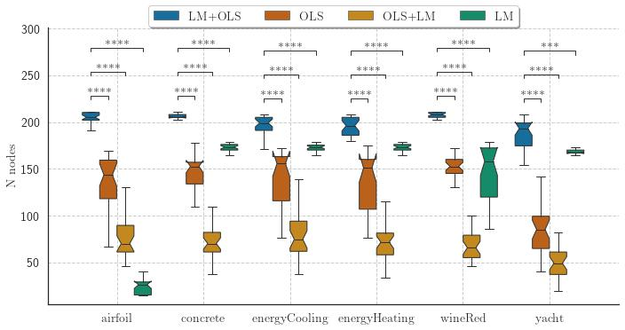

# itea-julia

Julia implementation of the Interaction-Transformation Evolutionary Algorithm (ITEA) for symbolic regression, coupled with different optimization heuristics to adjust linear and non-linear coefficients in the expressions.

The expressions are in the form:


with  being the inner offset and scalar coefficient of the _i_-th interaction (and  being the collection of all pairs of inner coefficients):


For example, one possible equation could be as following:


-----

## Paper abstract

> Symbolic Regression is the task of finding a mathematical expression to describe the relationship between one or more independent variables with a dependent variable. The search space can be vast and include any algebraic function; thus, finding optimal values for coefficients may not be a trivial task. The Interaction-Transformation representation alleviates this problem enforcing that the coefficients of the expression is part of a linear transformation, allowing the application of least squares. But this solution also limits the search space of the expressions. This paper proposes four different strategies to optimize the coefficients of the non-linear part of the Interaction-Transformation representation. We benchmark the proposed strategies by applying the Interaction-Transformation Evolutionary Algorithm (ITEA) to six well-known data sets to evaluate four optimization heuristics combining linear and non-linear methods. The results show that optimizing the non-linear and linear coefficients separately was the best strategy to find better-performing expressions with a higher run-time and expression size. The non-linear optimization method alone was the worst-performing method.

## Installation

From the root folder, start a julia terminal and enter in the _pkg_ manager
environment by pressing ``]``. To add itea-julia to your local packages:

```julia
dev ./ITEAregressor
```

Now you can use the "original" ITEA as well as the ITEA with non-linear least 
squares optimization by importing it:

```julia
using ITEAregressor
```

The first time you import, Julia wil precompile all files, this can take a while.

## Usage

First import the required packages, load a data set and split the data into the training matrix and vector:

```julia
using CSV
using DataFrames

import ITEAregressor: ITEA

df_train = CSV.File("./experiments/datasets/yacht-train-0.dat") |> DataFrame

train_X = Matrix{Float64}(df_train[:, 1:end-1])
train_y = Vector{Float64}(df_train[:, end])
```

you can now fit an expression with ITEA:

```julia
bestsol = ITEA(
    train_X, train_y,
    ["identity", "sin", "cos", "tan", "log", "exp", "sqrt"],
    max(1, size(train_X, 2) ÷ 2),

    popsize       = 250,
    terms_bounds  = (1, 5),
    strength_bounds   = (-2, 2),
    gens          = 400,
    adjust_method = "levenberg_marquardt_ordinary_least_squares_adj",

    mutationWeights = [.11, .11, .11, .33, .33],
    fitness_method="RMSE",
    verbose=20)
```

`Verbose` is used to determine the number of generations between each status update:

```bash
+------+-----------+-----------+------------+----------+
|  Gen |  Best Fit |  Avg Fit  | Smlst Size | Avg Size |
+------+-----------+-----------+------------+----------+
|   20 | 1.613e+00 | 2.036e+00 |         23 |   57.244 |
|   40 | 1.488e+00 | 1.689e+00 |         34 |   56.976 |
|   60 | 1.488e+00 | 2.011e+00 |         16 |   54.868 |
|   80 | 1.488e+00 | 1.020e+03 |         16 |   54.032 |
|  100 | 1.395e+00 | 1.510e+00 |         34 |   56.684 |
|  120 | 1.395e+00 | 1.524e+00 |         42 |   56.448 |
|  140 | 1.322e+00 | 1.525e+00 |         34 |   60.480 |
|  160 | 1.322e+00 | 1.495e+00 |         37 |   61.640 |
|  180 | 1.322e+00 | 2.405e+00 |         34 |   61.944 |
|  200 | 1.322e+00 | 1.813e+00 |         45 |   62.664 |
|  220 | 1.322e+00 | 9.999e+99 |         34 |   61.804 |
|  240 | 1.322e+00 | 1.772e+00 |         34 |   62.408 |
|  260 | 1.322e+00 | 9.350e+00 |         37 |   62.660 |
|  280 | 1.322e+00 | 1.484e+00 |         34 |   62.024 |
|  300 | 1.322e+00 | 1.569e+00 |         34 |   62.332 |
|  320 | 1.322e+00 | 1.496e+00 |         45 |   62.540 |
|  340 | 1.322e+00 | 1.531e+00 |         34 |   61.560 |
|  360 | 1.322e+00 | 1.472e+00 |         37 |   62.480 |
|  380 | 1.322e+00 | 1.487e+00 |         23 |   62.584 |
|  400 | 1.322e+00 | 1.473e+00 |         48 |   63.364 |
+------+-----------+-----------+------------+----------+
```

now we can inspect the final expression and use it to predict new values:

```julia
# Getting a string representation
print(to_str(bestsol, digits=3)) # will held
```

will held:

```
5-element IT expression:
 -3.545 * cos( -8.366 + -29.299 * p(X, Float16[0.0, -2.0, 0.0, -1.0, 0.0, 2.0]) )
 0.137 * identity( 21.144 + 265.669 * p(X, Float16[0.0, -2.0, 0.0, 0.0, 0.0, 2.0]) )
 17.264 * identity( 21.107 + 15.84 * p(X, Float16[0.0, 0.0, 0.0, 0.0, 0.0, 1.0]) )
 51803.089 * identity( -4.396 + 0.148 * p(X, Float16[0.0, 0.0, 0.0, 0.0, 0.0, 2.0]) )
 -8783.642 * log( 1.0 + 1.0 * p(X, Float16[0.0, 0.0, 0.0, 0.0, 0.0, 2.0]) )
 227329.64299878755
```

To predict new values you must always pass a matrix. For a single value:

```julia
#predicting values
print(bestsol(train_X[1:1, :]))
```

will held:

```
[2.163340492581483]
```

## Experiments

The experiments evaluated four different heuristics to optimize the coefficients of the generated expressions:

* "levenberg_marquardt_ordinary_least_squares_adj";
* "levenberg_marquardt_adj";
* "ordinary_least_squares_adj";
* "ordinary_least_squares_levenberg_marquardt_adj".

The final results showed that the `levenberg_marquardt_ordinary_least_squares_adj` is capable of obtaining the best performing expressions (in terms of NMSE) but also the largest expressions.

### NMSE boxplot


### Number of nodes boxplot

